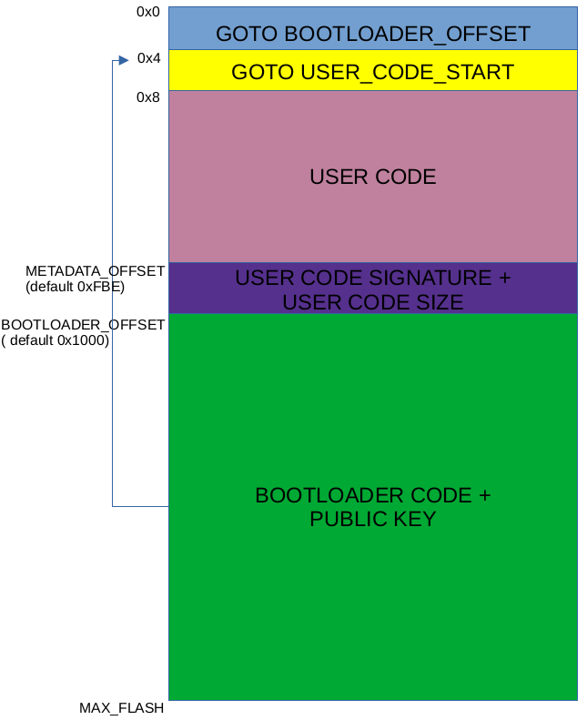

A secure bootloader for an 8bit MCU(PIC18)

# Why

We have multiple implementations of **secure** bootloaders for 32-bit ARM MCUs.

I wondered if there is one for 8-bit MCUs, but I found none.

Then I started implementing a **secure** bootloader for a 8-bit MCU.

During the process I managed to implement one, but I also found out why there isn't one already.

But anyway, here it is.

# What is secure boot

Secure boot means executing only **trusted** code.

Trusted code, is code that was digitally signed with a cryptographic algorithm.

No one who does not poses the "secret", should be able to replicate the signature.

Thus, the secure bootloader should be able to distinguish a firmware that is validly signed and execute it.

If the signature for a firmware is invalid(or missing), the bootloader should refuse to execute that code.

# Briefly on the public key cryptographic signing

The cryptographic signing algorhitms make use of the **cryptographic key pair**.

The key pair means a random mathematically generated pair of keys with very nice properties.

There are two keys in a pair:

- the **private key** that you never share with anyone

- the **public key** that you can share with everyone

The takeway properties are:

1. You can't derive the private key from the public key(without a quantum computer, in reasonable time)

2. The key pair can be used for encrypting and decrypting data without revealing the private key

3. Whatever you sign with the private key can be checked for authenticity with the public key

*Property 1* guarantees us that we can share the public key with everyone and they will not be able to find out the private key and impersonate us.

*Property 2* is used for encrypting data, but here we are not ecrypting the firmware but only signing it.

*Property 3* is what this bootloader uses to check that the firmware it's trying to execute was flashed by the trusted author. The trusted author is the only one that is able to generate a valid signature,
because only he has the private key.


The cryptographic signature is usually computed on the result of a hash function(SHA256, SHA512 etc.), hash of the data you want to sign.

The hash function is used because it ensures that the data you want to sign is always the same size.
A SHA256 hash is always 256 bits long regardless if you hash 10 bytes or 10GB.

The hash function should ensure a minimum risk of collision(two different hashed payloads that would result in the same hash).

The public key used for signature verification is stored in MCU's flash, and is set at compile time.


# How does this bootloader do secure boot

The cryptographic signing and verification algorhitm is based on public key cryptography employing a 256 bit elyptic curve(ECC).
More specific the **secp256k1** curve. This is an industry standard algorithm.

The cryptographic validation function needs three input parameters:
- the SHA256 checksum of the signed data
- the public key needed to check the data
- the cryptographic signature that was generated by the code owner(using the private key)

The validation function will confirm the authenticity of the flashed firmware.

Secure boot process is the following:
- at MCU reset, bootloader starts, and checks if it goes into flashing mode or boot mode. The steps bellow are for boot mode:
- bootloader reads from a reserved area in flash the `size` of the flashed firmware
- bootloader reads and computes the SHA256 checksum of the flashed firmware(on a count of `size` bytes from previous step)
- bootloader reads from a reserved area in flash the `signature` of the flashed firmware
- with the information obtained from steps above, bootloader calls the cryptographic validation function and decides whether to execute or not user's firmware

Without using these two repos bellow, this bootloader would not have been possible:

https://github.com/kmackay/micro-ecc - for the EC cryptographic signature check algo

https://github.com/B-Con/crypto-algorithms/blob/master/sha256.c - the SHA256 algo

# The flashing tool

The [flashing tool](host/btld.py) is a python script running on a computer and needs a serial UART interface.

Flashing tool's purpose is:
- send the firmware from the hex to the MCU's bootloader over serial interface
- compute the cryptographic signature of the firwmare and send it to bootloader

The flashing tool receives 3 parameters:
1. `.hex` file containing the firmware that will be flashed
2. serial device to be used for communication with the MCU
3. private key to be used for signing the firmware

From the perspective of the flashing tool, the usual flashing process goes this way:
- it handshakes with the MCU's bootloader to notify the MCU that it wants to flash
- it sends to bootloader the contents(addresses and adata) of the `.hex` file to flash
- it computes the SHA256 hash of the data from the hex
- computes the cryptographic signature of the SHA256 hash, using the private key
- sends to bootloader the size in bytes of the flashed firmware
- sends the cryptographic signature to bootloader
- notifies bootloader that flash process ended

# Flash memory arrangement



*NOTE*: this part mentions multiple times the `GOTO WHATEVER_ADDRESS` instruction.
This instruction results in the program counter(aka instruction pointer) being loaded with the `WHATEVER_ADDRESS`.
The `GOTO` instruction occupies 4 bytes of flash.

After reset, MCU starts executing code at address 0.

At address 0, a `GOTO BOOTLOADER_OFFSET` instruction is placed.
This ensures that at every reset the bootloader code will be executed.

If bootloader code decides that user code is correctly signed, it will `GOTO` address 4 of flash, where a `GOTO USER_CODE_START` instruction is placed.

Starting from address 8, user code is placed(interrupt handlers included, if any).

Bootloader doesn't set any interrupt handlers.

At address `BTLD_OFFSET - CODE_SIZE - SIGNATURE_SIZE`, space for boot metadata is reserved.
This region needs 66 bytes. 2 bytes holding the size of the user code and 64 bytes holding the signature of the user code.
User code must end before this bootloader metadata region starts.

## Bootloader flash offset

In order to place the bootloader code at end of flash, bootloader code is compiled with `mcodeoffset=0x1000` compiler flag.

This will place the bootloader code starting at address `0x1000`.

When using this compiler flag, the resulted hex will be filled only with `NOP(0xFF)` instructions until the offset `0x1000`.

At reset we always want to jump directly to bootloader code instead of executing NOP.

Thus I wrote a [tool](tools/btld-patch.py) python script that patches the bootloader to have `GOTO BOOTLOADER_OFFSET`(0x1000) as the instruction at address 0.

This tool is called by the project's Makefile, so you will always have your bootloader hex file patched correctly after building.

The bootloader code offset needs to be adjusted:
- if a MCU with a bigger flash size is used, so MCU will be placed at end of flash(prevents flash space waste)
- if bootloader size increases above a certain limit, in order to be able to still fit in flash
- if bootloader size decreases, if needed to increase available flash space for user code

## User code GOTO

MCU starts code execution at address 0 of flash(reset address).

When compiling C code with XC-8 compiler, the compiler will place a `GOTO CODE_START` instruction at address 0 of your resulted hex file.

Since we want to always have the bootloader code executed after MCU reset, the bootloader will relocate the user code's start `GOTO` instruction from address 0 to address 4.

From address 4 to address 8(interrupt handler start) the compiler does not place any code.
This makes it safe to use address 4-7 to relocate the `GOTO USER_CODE` instruction.

Of course, bootloader needs to take into account this relocation when it reads user firmware for signature verification purpose.

# Bootloader - flashing tool UART protocol

## Flashing commands

Communication between the host flashing tool and MCU's bootloader is always started by the flashing tool.

The flashing tool sends a multiple byte command and bootloader replies with only one byte(success or error type).

The message format for the flashing tool initiated messages is the following:

`Message start byte + Message operation + Message payload + Message end byte`

Message start byte: `@`

Message end byte: `\n`

Message operation byte:


| Message operation byte | Meaning          | Message payload                                                                  |
|------------------------|------------------|----------------------------------------------------------------------------------|
|          D             | Flashing data    | data count(1 bytes) + flash address(2 bytes, LE) + flashing data(multiple bytes) |
|          M             | Program size     | 2 bytes, LE                                                                      |
|          N             | Signature        | 64 bytes signature of flashed data                                               |
|          X             | Flash end        | no payload                                                                       |


Bootloader replies to every message with a single byte:


| Response byte | Meaning                                                        |
|---------------|----------------------------------------------------------------|
|          F    | Successful operation                                           |
|          A    | Denied flashing address(bootloader metadata or code overwrite) |
|          I    | Invalid payload(payload size doesn't match operation type)     |


This message format also needs an escape byte for payloads that may contain the message start byte, the message end byte or the escape character itself.
The escape byte is `\`.

For example the data message `@D3a5@Xy\n` would get sent over UART as `@D3a5\@Xy\n`, by escaping the `@` character inside the payload.
This way the bootloader would not mistake it with the message start byte.

## Handshakes
Besides the flashing command messages, there is also a handshake message and its reply, exchanged between flashing tool and bootloader.

To make itself heard by the bootloader, at its start, as handshake procedure, flashing tool sends in a loop `@BTL\n`.
Bootloader checks at its start for this message with a timeout, and will reply with `@OK\n` if it's ready to accept flashing commands.
This is the only time when bootloader replies with more than 1 byte.

After handshake is over, the flashing tool will start sending flashing commands and data.

## Signature validation feedback

After bootloader validates the image signature, it will send over UART a byte char that indicates the status:

- `S` user code valid signature(as result, user code is in execution)

- `K` user code invalid signature(as result, MCU was reset)

These status bytes are the result of checking the signature, and this happens when the bootloader did not get into flashing mode, but in boot mode(handsake with flashing toold didn't occur).
So these messages are not part of the flashing tool to bootloader UART protocol, but are just a mean of providing feedback on how the signature validation went.

# The bad

As I said in the first part, there's a reason that no one(that I know of) wrote a secure bootloader for a 8-bit device.

## Very slow

Running cryptographic algorhitms in software(without hardware acceleration), on a 8-bit, RAM restricted MCU is very demanding.
This makes the flashed image validation very slow and probably unpractical.
Time is needed to read the user code from flash memory, compute SHA256 on it and then do the cryptographic validation on the image signature.

The time to run the signature validation is constant since we're always validating a 256 bit value(image's SHA256 hash).

On the other side, the time needed to read the flash and to run SHA256 hashing is dependent on the size of the user image.
So the bigger the image, more time is needed to validate it.

It takes **~48s** to validate a 1802 bytes image.

## Big flash footprint

This bootloader consumes ~28KB of flash.

The PIC18F25K22 MCU where I developed it, has available 32KB of flash.

User code available space is <25% of the whole flash.
You can fit a decent program in the remaining space, but having 87% of flash spent in bootloader code is far from ideal.

A lower end device couldn't even host the bootloader in their flash.

## Validating the validator

This bootloader helps you validate the authenticity of the user flashed code.

But who validates the authenticity of the bootloader? In the case of PIC18 devices, no one.

There are MCUs that support secure boot by design, so there is a mechanism implemented in hardware that will validate the signature of the bootloader.

In these secure devices the public key used for validation is flashed into fuses.

At every MCU reset, the secure boot validation hardware will validate the authenticity of the bootloader using the public key from the fuses.

The MCU will run the bootloader only if its cryptographic signature is correct.

This means that you know for sure that the bootloader validating your user code is also authentic.

Unfortunately, this is not the case on the low end 8 bit MCUs.

So anyone with physical access to the MCU can overwrite the bootloader or the public key, breaking secure boot process.

There's no solution to this, if the MCU doesn't support secure boot by design.

This secure bootloader solution is secure as long as no one has physical access to the MCU.

The good part is that even in case of physical access, no one can read your private key, since the private key is not found in the flash of MCU.
 
## Denial of service

This is what I consider the last *nail in the coffin* for this implementation.

The problem is that a malicious actor, or a trusted person by accident, can send an image with a bad signature to the bootloader.

Because of its design, the bootloader, during the flashing phase, will first erase flash and then start flashing the user image.

If flashed user code has a bad signature, user code will not be executed.

This can be exploited in a denial of service attack where an attacker intentionally sends an image with a bad signature to prevent the product from being used.

**The attacker can't run any malicious code since it can't validly sign it, but it can make sure that your product doesn't run any code at all**(besides the bootloader).

It's better to not run code at all than run malicious code, but this scenario is a big deal in the real world.

I don't think any company could accept this.

This kind of problem can be solved by a bootloader that implements two paritions(active/inactive) for user code.

The bootloaders that implement this partioning scheme always have a *good* firmware image written on their active partition.

Any new uploaded user image is flashed to the inactive partition.

Only after successfully validating the new image, the bootloader will switch the partitions.

If the firmware has a bad signature, the old firmware remains the active one, thus preventing a DoS attack or accidental writes with wrong signatures.

## Quality

During development I realised that this bootloader will probably never reach production grade quality, because nobody will want it for reasons exposed above.

Thus, there are some TODOs left in the code or some places where macros should have been used instead of hardcoding.

The UART protocol and flash access functions only support 16bit addresses.
So the bootloader in this form would work only for devices that have flash size <=64kB.
Fortunately it's not very hard to extend support for bigger flash sizes.

There's no checksum for the UART protocol. This is not a security issue though, but a reliability issue.

Also, I'm a python noob, so this is most probably reflected in the host flashing tool code.

These aside, the secure boot process should be correct under a specific scenario(no physical access, not caring about denial of service).

# Using the project

## Compiling the bootloader

You will need Microchip's XC-8 compiler and python3 in order to compile the bootloader code.

Adjust your compiler path in the [Makefile](bootloader/Makefile).

The compiler and the bootloader patching tool are invoked from the `Makefile`.

```
cd bootloader
make
```

Flash on your MCU the resulted `bootloader_patched.hex` file.

## Flashing tool usage

`python host/btld.py SERIAL_PORT HEX_FILE PRIVATE_KEY_PEM_FILE`

Example of how I'm using it(under Linux):

`python host/btld.py /dev/ttyUSB1 test-hexes/escape-bytes.hex ../ec256-keys/private-key.pem`

## Generating and using the cryptographic key pair

In order to generate the cryptographic keys, OpenSSL CLI is used.
OpenSSL is available on all platforms.

Generate `secp256k1` private key in a file named `private-key.pem`:

`openssl ecparam -name secp256k1 -genkey -noout -out private-key.pem`

You will need the private key everytime you sign the firmware. Don't share it with anyone untrusted.
If anyone else knows your private key, it will be able to impersonate you and validly sign a potentially malicious firmware.

Extract the public key from the private key:
`openssl ec -in private-key.pem -pubout -text`

You will put the public in the bootloader code. The bootloader will use the public key to validate the firmware signature.
Check for the `pub:` output of the command above.
My public key appears as:
```
pub:
    04:ce:30:36:7c:c1:6e:b0:8c:5f:0e:b0:2c:11:4f:
    8f:78:08:85:ec:cf:db:73:c8:da:6d:9a:00:6a:33:
    95:a2:20:cb:dd:b2:9d:97:a0:5c:0f:0f:4f:66:66:
    28:d2:e6:29:3e:3b:28:72:46:eb:d9:9f:a0:e2:9a:
    a8:a6:9e:fc:2c
```

This will be translated into the following C array holding the public key in bootloader's [main code](bootloader/main.c) source file:
```
const uint8_t ec_pub_key[] = {
    0xce,0x30,0x36,0x7c,0xc1,0x6e,0xb0,0x8c,0x5f,0x0e,0xb0,0x2c,0x11,0x4f,
    0x8f,0x78,0x08,0x85,0xec,0xcf,0xdb,0x73,0xc8,0xda,0x6d,0x9a,0x00,0x6a,
    0x33,0x95,0xa2,0x20,0xcb,0xdd,0xb2,0x9d,0x97,0xa0,0x5c,0x0f,0x0f,0x4f,
    0x66,0x66,0x28,0xd2,0xe6,0x29,0x3e,0x3b,0x28,0x72,0x46,0xeb,0xd9,0x9f,
    0xa0,0xe2,0x9a,0xa8,0xa6,0x9e,0xfc,0x2c
};
```

**Note!** the first byte(`0x04`) from the OpenSSL public key is not used in the C array. That first byte is not part of the key, but metadata.

Now you have the key pair needed to sign and verify signatures. The private key will be kept on the computer and will be used by the flashing tool.
The public key will get flashed on the MCU along with the bootloader code.

# Conclusion

The true value of this secure bootloader is **educational**.

I think it's a great tool to learn about bootloaders and secure boot process in embedded systems.

The key points of this bootloader are:

* uses an **industry standard security algorithm**

* runs on a very constrained MCU(8 bit, 1.5kB RAM, 32kB flash)

* is secure only under specific scenarios

* not fit for production usage for all the reasons explained above

* good educational tool

* probably the only one of its kind


P.S. I also wrote in the past a non-secure bootloader for PIC18 https://github.com/spanceac/PIC18-bootloader